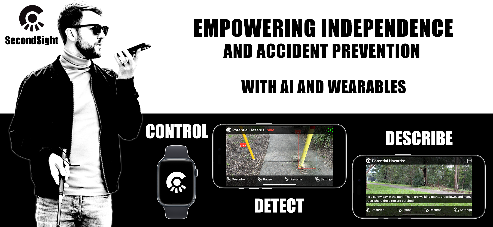
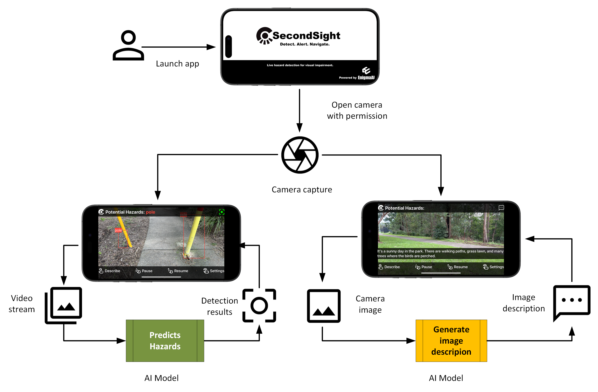

# SecondSight

https://github.com/user-attachments/assets/02046dc4-226e-48f1-9870-5790a50f23e4

**An AI-Powered Assistive Tool for Visual Impairment**

SecondSight is an iOS application that leverages state-of-the-art artificial intelligence to enhance safety and spatial awareness for individuals with visual impairment. Using real-time hazard detection and scene description, SecondSight aims to prevent accidents and improve independence for users with complete blindness or low vision.

**⚠️ IMPORTANT:** This is a prototype for proof of concept and academic purposes ONLY. For health and safety, practical use is **STRICTLY PROHIBITED**. This application is NOT a replacement for certified assistive tools or medical devices.

## Overview


SecondSight addresses critical safety gaps in existing assistive technologies for the visually impaired. While traditional tools like canes and guide dogs are invaluable, they can sometimes miss small hazardous objects at close proximity. SecondSight complements these methods by providing:

1. **Automated Hazard Detection**: Continuous real-time detection of small obstacles (rocks, bottles, potholes, poles, stairs) within 2-3 strides distance
2. **Scene Description**: On-demand AI-generated descriptions of the surrounding environment
3. **Accessible Feedback**: Dual-channel alerts via haptic feedback and speech descriptions

### Goals and Objectives
- Enhance accident prevention and promote safety
- Increase awareness of surroundings for greater peace of mind
- Alleviate economic burden on the welfare system
- Enhance assistive tool accessibility across social, economic, and geographic boundaries
- Promote independence and enhance social wellbeing

## Key Features

### 1. Hazard Detection Mode
When the camera is pointed toward the ground (covering approximately 2-3 strides distance), the app continuously detects **5 common hazardous objects**:
- Rocks
- Bottles
- Potholes
- Poles
- Stairs

**Detection Response:**
- **Haptic feedback** on iPhone (and Apple Watch if paired)
- **Speech alerts** describing the detected hazard
- **Visual bounding boxes** with labels (for sighted caregivers)
- Response time: **< 300ms** for real-time accident prevention

### 2. Scene Description Mode
Users can request detailed environmental descriptions at any time:
- **Two-finger tap** anywhere on the screen to trigger scene description
- AI-generated descriptions using Apple's **FastVLM** (on-device)
- Provides context about hazards and general surroundings
- **Fully offline** - no internet connection required

### 3. Simple Gesture Controls
Designed for accessibility with minimal interaction:
- **Zero interaction to start**: Detection begins automatically on launch
- **Two-finger tap**: Request scene description
- **Swipe down**: Pause detection
- **Swipe up**: Resume detection

### 4. Apple Watch Companion App
- **Full standalone companion app** for wearable-only operation
- Receive haptic feedback and notifications directly on the wrist
- Allows for more discreet and convenient alerts
- Fully integrated with iPhone via Bluetooth pairing

### 5. Intelligent Mode Switching
- **Automatic camera angle detection** using gyroscope
- **< 30° from ground**: Activates hazard detection mode
- **> 30° from ground**: Switches to scene description mode
- Seamless transitions without manual intervention

---

## Architecture

SecondSight uses a **component-based architecture** with three key components:

1. **User Interface (iOS App)**
   - Swift/SwiftUI implementation
   - Single-screen design for simplicity
   - High-contrast, large fonts for accessibility
   - Gesture-based controls

2. **Model Inferencing**
   - **On-device**: YOLOv11n CoreML for hazard detection
   - **On-device**: Apple FastVLM for scene description (fully offline)
   - Optimized for mobile device resource constraints
   - No internet connection required for core functionality

3. **Machine Learning Operations (MLOps)**
   - Automated pipelines using **ClearML**
   - Two pipelines: Hazard Detection and Scene Description
   - Continuous Integration/Continuous Deployment (CI/CD)
   - Model training on Google Cloud remote agents

### System Architecture Diagram


The system integrates:
- **Video Processing**: Real-time camera feed handling with gyroscope-based angle detection
- **Hazard Detection**: YOLOv11n inference on-device (camera angle < 30°)
- **Scene Description**: Apple FastVLM inference on-device (camera angle > 30°)
- **User Feedback**: Haptic, speech, and visual alerts
- **Apple Watch Integration**: Full companion app for standalone operation

---

## Requirements

### Hardware Requirements
- **Device**: iPhone 14 Pro or later (iPhone 15 Pro Max recommended for testing)
- **Processor**: A16 Bionic chip or later
- **RAM**: Minimum 6GB
- **OS**: iOS 17 or later
- **Optional**: Apple Watch for companion app functionality

### Software Requirements
- **Development**:
  - Xcode IDE
  - Swift programming language
  - Apple Developer Account
  - iTunes Connect Account
  
- **ML Pipeline**:
  - Python 3.x
  - ClearML for MLOps
  - PyTorch
  - FastAPI for remote inference
  - CoreML for on-device deployment

### Permissions
- Camera access (required)
- Motion & orientation access (required for gyroscope-based mode switching)

---

## Installation

### For Users
1. Ensure your device meets the hardware requirements
2. Obtain the SecondSight app from your Apple Developer portal
3. Install the app on your iPhone 14 Pro or later
4. Grant camera permissions when prompted
5. (Optional) Install the companion app on Apple Watch

### For Developers
1. Clone the repository:
   ```bash
   git clone https://github.com/your-repo/SecondSight.git
   ```

2. Open the project in Xcode

3. Configure your Apple Developer Account and signing certificates

4. Download the CoreML model and add it to the project

5. Build and deploy to your device:
   - Select your target device
   - Build and run (⌘R)

6. For Apple Watch companion:
   - Select the Watch target
   - Build and deploy to paired Apple Watch

**Note:** Follow Apple's official development guidelines for detailed account setup, app signing, and deployment procedures.

---

## Usage

### Getting Started
1. **Launch the app**: A splash screen will appear for 3 seconds showing the SecondSight logo
2. **Detection starts automatically**: The app immediately begins hazard detection
3. **Point camera downward**: Aim the camera toward the ground at an angle that covers 2-3 strides ahead

### During Use
- **Automatic Mode Switching**: 
  - Point camera **down (< 30°)**: Hazard detection mode activates
  - Point camera **up (> 30°)**: Scene description mode activates
- **Hazard Detected**: You'll receive haptic feedback and a voice alert (e.g., "Rock ahead")
- **Request Scene Description**: Two-finger tap anywhere on screen (works offline)
- **Pause Detection**: Swipe down on screen
- **Resume Detection**: Swipe up on screen
- **Apple Watch**: Receive all alerts and notifications on your wrist

### Settings (Optional)
Hold the screen to access settings where you can toggle:
- Video display on/off
- Speech feedback on/off
- Haptic feedback on/off

**Note:** Settings adjustment requires some vision ability and is primarily intended for caregivers.

### Best Practices
- Use in **outdoor daytime** conditions with good lighting
- Point camera at ground level covering 2-3 strides distance
- Ensure phone is held steadily for optimal detection
- Use as a **complementary tool** with existing assistive devices (cane, guide dog, etc.)
- **Do NOT use** in low-light conditions or extremely hazardous environments

---

## Performance Metrics

SecondSight has been optimized and tested to meet the following performance targets:

| Metric | Target | Achieved | Notes |
|--------|--------|----------|-------|
| **Hazard Detection Recall** | ≥ 75% | 75.1% | Macro recall on test set (IoU 0.5) |
| **Hazard Detection Precision (mAP50)** | ≥ 80% | 81.7% | Improved from 73.3% after tuning |
| **Scene Description Quality (CIDEr)** | ≥ 0.50 | 0.47 | Baseline; stretch goal of 0.50 |
| **End-to-End Latency** | ≤ 300ms | ~35ms on-device | Critical for accident prevention |
| **Real-Time Throughput** | ≥ 20 FPS | 21 FPS | On iPhone 14 Pro (100 layers, 6.3 GFLOPs) |
| **Battery Efficiency** | ≤ 10% per hour | TBD | Profiling pending |
| **Memory Usage** | ≤ 200MB | Within limit | During continuous operation |

### Model Performance
- **YOLOv11n (Hazard Detection)**: Custom-trained on specialized dataset for downward-angle camera captures at 2-3 stride distances
- **ViT-GPT2 Student (Scene Description)**: Knowledge-distilled from LLaVA 1.5-7B for lightweight inference

---

## Technical Details

### Models

#### 1. Hazard Detection - YOLOv11 Nano
- **Framework**: YOLOv11n converted to CoreML
- **Deployment**: On-device (embedded in iOS app)
- **Classes**: 5 hazard objects (rocks, bottles, potholes, poles, stairs)
- **Input**: Continuous video stream from camera
- **Output**: Bounding boxes with labels and confidence scores
- **Performance**: 21 FPS on iPhone 14 Pro

#### 2. Scene Description - Apple FastVLM
- **Framework**: Apple FastVLM (Vision Language Model)
- **Deployment**: On-device inference (fully offline)
- **Input**: Single still image from camera
- **Output**: Natural language description of scene
- **Performance**: Slight delay on first load, faster on subsequent requests
- **Advantage**: No internet connection required, maintains user privacy

### MLOps Pipelines

#### Hazard Detection Pipeline (ClearML)
1. Dataset upload and analysis
2. Data preprocessing
3. Model training (YOLOv11n)
4. Hyperparameter optimization
5. Model evaluation
6. Model publishing to registry
7. Deployment to GitHub (CI/CD trigger)
8. PyTorch → CoreML conversion
9. Integration into iOS app

#### Scene Description Pipeline (ClearML)
1. Dataset preparation with caption generation
2. Knowledge distillation training
3. Model fine-tuning
4. Evaluation (BLEU/CIDEr metrics)
5. Model publishing
6. Deployment to FastAPI server
7. Model loading at application startup

### Technology Stack
- **Frontend**: Swift, SwiftUI
- **ML Frameworks**: PyTorch, CoreML, Vision, Apple FastVLM
- **MLOps**: ClearML, GitHub Actions
- **Cloud**: Google Cloud (for training agents)
- **Sensors**: CoreMotion (gyroscope for angle detection)
- **Haptics**: CoreHaptics framework
- **Speech**: AVFoundation (Text-to-Speech)
- **Watch**: WatchKit, WatchConnectivity

---

## Limitations

### Current Constraints
- **Device Compatibility**: iOS devices only (iPhone 14 Pro+); Android not supported
- **Lighting Conditions**: Best performance in outdoor daylight; not optimized for low-light or night conditions
- **Weather**: May not perform well in rain, fog, or other adverse weather conditions
- **Hazard Classes**: Limited to 5 predefined hazard types
- **Battery Consumption**: Continuous camera and detection may drain battery quickly
- **Detection Distance**: Effective range limited to 2-3 strides ahead

### Safety Limitations
- **Not TGA/FDA approved** as a medical device
- **No emergency call functionality**
- **No navigation or path guidance**
- **Should NOT replace** certified assistive tools or guide dogs
- **Requires visually-abled person** for initial setup and installation

### Model Limitations
- Dataset availability constraints may limit accuracy improvements
- Training time requires significant compute resources
- False negative rate target: < 5% for critical hazards
- False positive rate: < 10% of total detections

---

## Future Work

### ✅ Recently Implemented (Showcase Version)
- **Offline Scene Description**: Apple FastVLM for on-device operation (no internet required)
- **Apple Watch Standalone**: Full companion app integrated for wearable-only operation
- **Gyroscope Integration**: Automatic camera angle-based mode switching (< 30° = detection, > 30° = scene description)

### Planned Enhancements (v4.0+)
- **Cloud-based Detection**: Move detection to cloud to reduce device resource consumption
- **Microservices Architecture**: Better resource allocation for model inferencing
- **Android Support**: Expand to Android devices for wider accessibility
- **Voice Control**: Hands-free interaction with voice commands
- **Auto-Model Updates**: Cloud-based model updates without app reinstall
- **Battery Optimization**: Improved power management for extended usage
- **Low-Light Enhancement**: Night vision mode with grayscale optimization
- **Expanded Hazard Classes**: More object types based on user feedback
- **External Integration**: Support for Braille displays and other assistive hardware
- **Visual Question Answering (VQA)**: Interactive queries about the environment
- **Navigation Assistance**: Path planning and obstacle avoidance guidance
- **Emergency Services**: One-tap call for help functionality

---

## Project Background

### The Problem

According to the World Health Organization (WHO, 2023):
- **2.2 billion people** worldwide have vision impairment or blindness
- In Australia: **453,000-840,000** people are blind or visually impaired
- By 2030: Expected to exceed **1.04 million** in Australia alone

**Economic Impact:**
- Global productivity loss: **~$411 billion USD annually**
- Australia: **$27.6 billion AUD annually** ($46,950 per person with vision loss aged 40+)

**Safety Challenges:**
- Higher rates of accidents requiring hospitalization (stairs, door collisions, burns, medication errors)
- Increased risk of serious life events (explosions, assaults, life-threatening injuries)
- Greater likelihood of falls, fractures, and early nursing home entry

### Gaps in Existing Solutions

**Current Support Options:**
- **Canes**: May miss small hazardous objects
- **Guide Dogs**: Expensive, require extensive training, limited availability
- **Personal Assistants/Carers**: Not available 24/7, require scheduling
- **Existing Apps** (Seeing AI, Envision AI, Be My Eyes): No specialized hazard detection for close-proximity obstacles

**SecondSight's Unique Value:**
- **Hazard-specific detection** for small objects at 2-3 stride distance
- **24/7 availability** without need for human assistance
- **Affordable and accessible** (uses existing smartphone hardware)
- **Complementary tool** that works alongside traditional methods

### Societal Impact Goals
- Improve safety and reduce accident-related medical costs
- Enhance independence and reduce caregiver burden
- Build self-confidence for environmental interaction
- Improve psychological wellbeing and reduce anxiety
- Promote equality by reducing discrimination based on disability

### Environmental Considerations
- **Energy Efficiency**: Lightweight models (YOLOv11n, distilled VLM) minimize GPU requirements
- **Hardware Reuse**: Leverages existing smartphones (no new hardware production)
- **Resource Optimization**: Distributed pipeline with CPU/GPU task separation
- **Future Integration**: Designed for third-party hardware compatibility to avoid closed ecosystems

---

## In Scope vs. Out of Scope

### ✅ In Scope (Showcase Version)
- Custom-trained YOLOv11n CoreML hazard detection (5 classes)
- Dual-channel alerts (haptic + speech)
- On-demand scene description via two-finger tap (Apple FastVLM - fully offline)
- Automatic mode switching via gyroscope (< 30° detection, > 30° description)
- iPhone 14 Pro / 15 Pro (A16+) support running iOS 17+
- Custom ML pipelines (YOLO + distilled VLM)
- Full Apple Watch companion app with standalone operation

### ❌ Out of Scope
- Navigation / path guidance
- Emergency call-for-help
- External hardware/software integration
- Model performance recall > 80%
- Android / other edge devices
- Replacing certified assistive tools
- Visual Question Answering (VQA)
- TGA approval as medical device

---

## Acknowledgments

This project was developed as part of academic research in AI-powered assistive technologies. Special thanks to:
- Vision 2020 Australia for background research and statistics
- WHO for global vision impairment data
- The visual impairment community for inspiring this work

---

## References

- Ahmetovic, D., et al. (2020). ReCog: Supporting Blind People in Recognizing Personal Objects. *CHI 2020*.
- Brunes, A., & Heir, T. (2021). Serious Life Events in People with Visual Impairment. *Int. J. Environ. Res. Public Health, 18*(21).
- Cleveland Clinic (2025). Low Vision. *Cleveland Clinic Health Library*.
- Lundälv, J., & Thodelius, C. (2021). Risk of Injury Events in Patients With Visual Impairments. *J. Visual Impairment & Blindness, 115*(5).
- Stangl, A. J., et al. (2018). BrowseWithMe. *ASSETS '18*.
- Vision 2020 Australia (2022). *2022-23 Pre-Budget Submission*.
- WHO (2023). Blindness and vision impairment: Facts.

---

## License

This project is for academic and research purposes only. Not licensed for commercial use or medical deployment.

---

## Contact

For questions or feedback about SecondSight:
- **Team**: EnigmaAI
- **Tech Lead**: Anna Huang

**Disclaimer**: SecondSight is a research prototype and proof of concept. It is not a certified medical device and should not be used as a replacement for professional assistive tools or services.